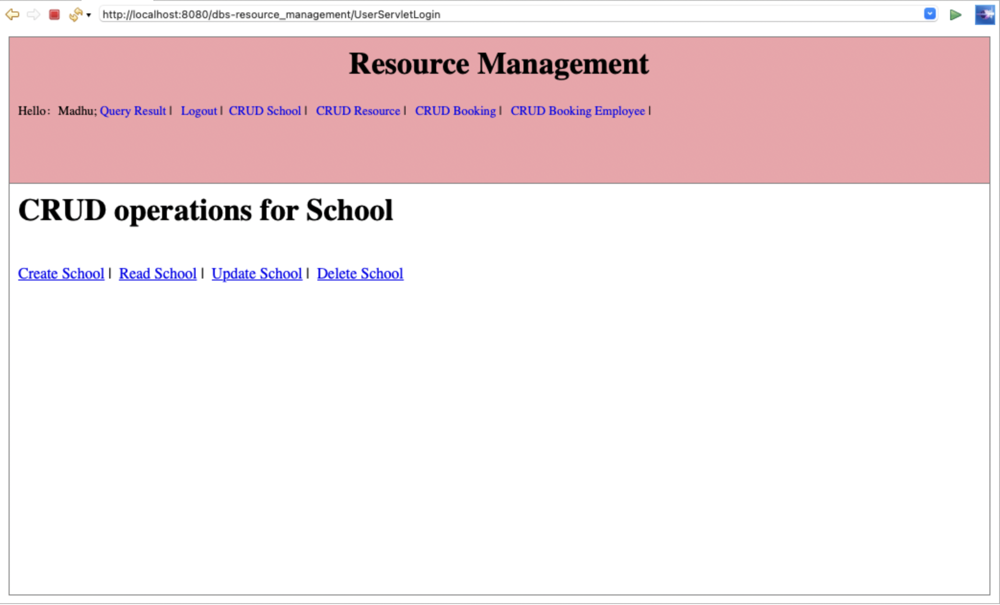
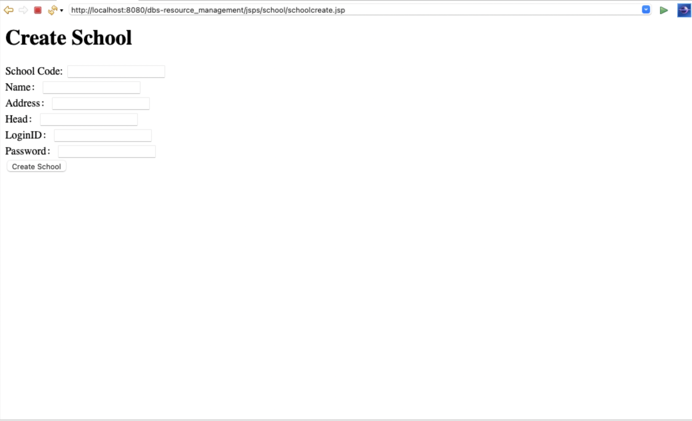
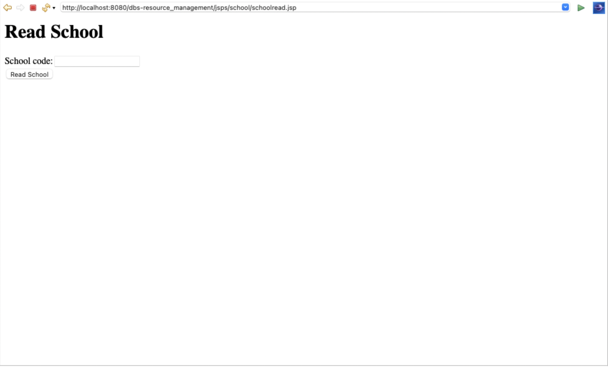
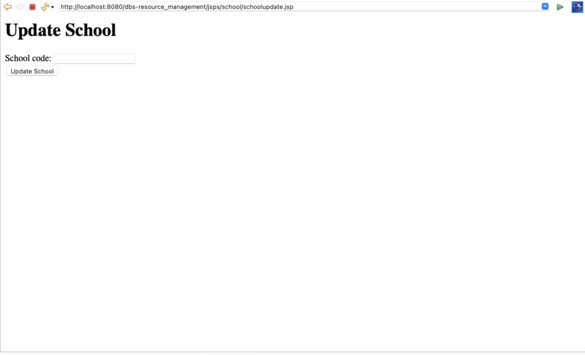

## Table of Contents
1. [Database](#database)
2. [Author(s)](#author)
3. [Database description](#description)
4. [Screen Shots for CRUD](#CRUD)
# Database
resource_management

# Author(s)
Shreya Raj Kati

Madhumitha Rajarajan

# Database description
The main idea behind this project is to collect data about the resources that are available in a particular school and use that information to allow access to other schools in the same community that lack those resources.
The entity school maintains the general information about all the schools such as the name, location and the head of the school.
The database resource collects the information about different types of resources that are available in a school and also how many such resources are available (15 laptops, 2 chemistry labs etc). The location of the resources (like labs or sports field) is also stored in the same table.
We also maintain a record of employees who are permitted to book these resources for any particular grade in a school in the table booking_employee. 
Then there is a booking table, where me manage the booking of resources (School xyz has booked chemistry lab "A" for Friday from 2:30 to 4:00) with the information about when the resource is booked, for how much capacity it is booked and also the number of hours it is booked for is stored. 

# CRUD

